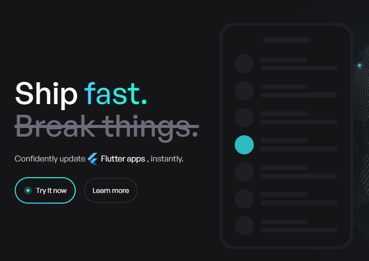
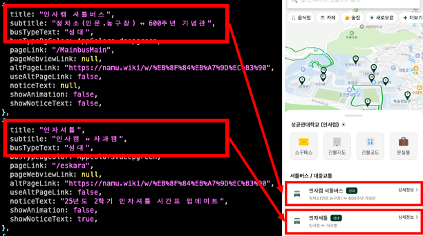
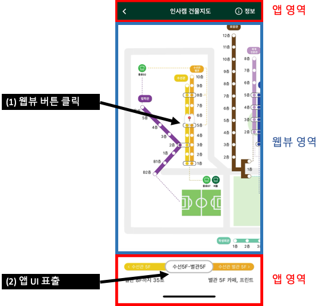
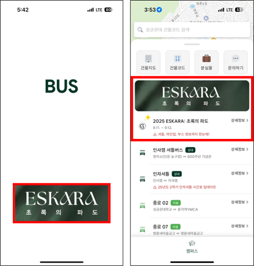
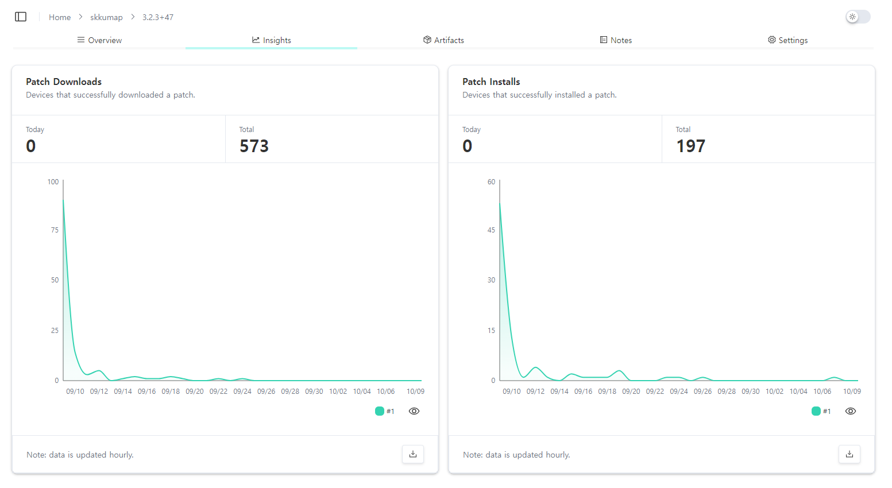

## 성균관대학교 '스꾸버스'의 고민

스꾸버스는 성균관대학교의 슈퍼앱으로, 버스·건물 정보와 축제 같은 실시간 이벤트 정보를 제공합니다. Flutter로 개발하면서 네이티브 앱의 장점을 활용하되, 자주 변경되는 화면은 웹뷰로 처리합니다.

**주요 문제:** 앱 개발 시 스토어 심사 과정이 병목이 됩니다. 실시간성이 중요한 버스 정보나 축제 기간의 빠른 업데이트가 필요할 때 스토어 심사 대기 시간은 치명적입니다.

## 기존 해결책: SDUI와 WebView

### Server-Driven UI (SDUI)

서버 API 응답에 따라 앱 UI를 동적으로 구성합니다.



스꾸버스는 API를 통해 버스 목록을 동적으로 추가하고 클릭 액션을 지정합니다.

**사례:** 메인화면 버스 목록에 "설 연휴 귀향/귀경 버스" 항목을 동적으로 추가하여 구글 폼으로 연결

### WebView



앱 내부에 웹페이지를 삽입하며, 앱과 양방향 통신이 가능합니다.

**사례:** '인사캠 건물지도' 탭에서 Flutter와 JavaScript가 상호작용

**한계:** 웹뷰와 앱 코드를 동시에 수정해야 하며, 복잡한 분기 처리가 어렵습니다.

```dart
void onMessageReceived(JavaScriptMessage message) async {
  Map<String, dynamic> messageData = json.decode(message.message);

  String? type = messageData['type'];
  // ... 추가 처리

  if (type == "add") {
    if (localleftcolor != null) {
      leftColor.value = localleftcolor;
    }
  }
}
```

## 축제 기간 마주한 한계


축제 '에스카라' 정보 업데이트 중 문제 발생:

1. **네비게이션 부재:** 웹뷰에서 상세 페이지 진입 후 뒤로 갈 방법이 없음
2. **외부 링크 처리:** 구글폼, 카카오톡 채널 등 외부 링크는 외부 브라우저로, 일반 링크는 내부 웹뷰로 처리해야 하는 복잡한 분기 필요

웹뷰는 OOPY 기반 노코드 도구로 만들어져 복잡한 분기 처리가 불가능했고, 앱 단 코드 업데이트가 필수였습니다.

## OTA 업데이트: Shorebird 도입

**코드 푸시**는 스토어 심사 없이 앱 코드를 실시간으로 배포하는 기술입니다. Flutter 창시자 Eric Seidel이 직접 개발한 Shorebird를 선택했습니다.

스꾸버스는 2025년 6월부터 Shorebird를 도입하여:
- 축제 배너를 로딩화면과 메인화면에 추가



- 새 웹뷰 기획에 따른 코드 업데이트 구현

### 웹뷰 네비게이션 개선 코드

```dart
WebViewController()
  ..clearCache()
  ..setNavigationDelegate(
    NavigationDelegate(
      onNavigationRequest: (NavigationRequest request) {
        final Uri uri = Uri.parse(request.url);

        // isMainFrame이 아니면서 http/https 프로토콜 확인
        if (!request.isMainFrame &&
            (uri.scheme == 'http' || uri.scheme == 'https')) {
          // oopy.io가 아닌 외부 링크만 외부 브라우저 실행
          if (!uri.host.contains('oopy.io')) {
            launchUrl(uri);
            return NavigationDecision.prevent;
          }
        }

        return NavigationDecision.navigate;
      },
    ),
  ),
```

**개선 사항:**
- URL 호스트 주소 확인으로 외부 링크 판별
- 웹뷰 네비게이션이 mainframe이 아닐 때 `url_launcher` 사용

## Shorebird 작동 원리

**(1) 개발자 release → (2) 개발자 patch → (3) 유저 패치 다운로드 → (4) 유저 패치 적용**

### 각 단계 설명

**(1) `shorebird release`**: 개발자가 스토어 배포용 앱을 빌드하고 Shorebird 서버에 등록한 후 앱스토어와 플레이스토어에 제출

**(2) `shorebird patch`**: 코드 수정 후 원본과의 차이점(diff)만 담은 '패치 파일' 생성 및 서버 업로드

**(3) 자동 업데이트**: 앱 실행 시 내장된 Shorebird 업데이터가 새 패치를 확인하여 다운로드하고 다음 실행 시 적용

**(4) 업데이트 완료**: 사용자가 다음 앱 실행 시 업데이트된 버전으로 실행

### 기술 구현

Shorebird는 Flutter와 Dart 레포지토리를 fork하여 직접 수정:
- **Dart SDK**: iOS 정책 준수를 위한 커스텀 인터프리터와 링커 추가
- **Flutter Engine**: 패치 다운로드·적용 업데이터 라이브러리 내장
- **Flutter Framework**: Shorebird 수정 버전을 사용하도록 빌드 프로세스 변경

## Point 1: 데이터 분석 함정

버전 상황:
- 스토어 버전: 1.0.0 → 1.1.0
- 코드 푸시 패치 버전: 1.2.0

### 시나리오 1: 신규 유저

스토어에서 1.1.0 다운로드

| 단계 | 사용자 행동 | 실제 버전 | Analytics 기록 | 비고 |
|------|----------|---------|------------|------|
| 1 | 최초 실행 | 1.1.0 | 1.1.0 | 백그라운드에서 1.2.0 다운로드 |
| 2 | 두 번째 실행 | 1.2.0 | 1.1.0 | 패치 적용되었으나 로그는 원본 기준 |

### 시나리오 2: 기존 유저

1.0.0 사용 중

| 단계 | 사용자 행동 | 실제 버전 | Analytics 기록 | 비고 |
|------|----------|---------|------------|------|
| 1 | 첫 실행 | 1.0.0 | 1.0.0 | 백그라운드에서 1.2.0 다운로드 |
| 2 | 두 번째 실행 | 1.2.0 | 1.0.0 | 패치 적용, 원본 기준 기록 |
| 3 | 스토어 자동 업데이트 | 1.1.0 | 1.1.0 | 원본 앱 자체 업데이트 |
| 4 | 다음 실행 | 1.2.0 | 1.1.0 | 패치 재적용, 새 원본 기준 |

**해결책:** `shorebird_code_push` 패키지로 버전 확인하고 Firebase `setUserProperty`로 추가 기록:

```dart
import 'package:shorebird_code_push/shorebird_code_push.dart';

Future<void> logVersionToAnalytics() async {
  final String baseVersion = "현재 앱 빌드 버전";
  final int? patchNumber = await ShorebirdCodePush().currentPatchNumber();

  final String effectiveVersion = patchNumber == null
      ? baseVersion
      : '$baseVersion (patch: $patchNumber)';

  await FirebaseAnalytics.instance.setUserProperty(
    name: 'effective_app_version',
    value: effectiveVersion,
  );
}
```

## Point 2: 패치 적용 시점

패치는 **2번째 앱 실행 시점**부터 적용됩니다. 이는 사용자 편의성과 안전성(native code 충돌, crash 위험)을 고려한 설계입니다.

**실제 데이터 예시:** 스꾸버스 iOS 3.2.3+47 버전



차이의 원인:
- 앱스토어 자동 업데이트로 버전 변경
- 사용자 이탈
- 패치 다운로드 오류 및 자동 롤백

**영향:** 치명적 버그 수정 패치도 다운로드 사용자 중 상당수가 앱 재실행 전까지는 버그를 경험하므로, CS 문의와 부정적 리뷰가 계속 유입될 수 있습니다.

**대응 전략:** 긴급 패치의 경우 "새로운 기능이 준비됐어요! 앱을 완전히 종료 후 다시 시작하면 적용됩니다"와 같은 스낵바나 팝업으로 사용자 업데이트 유도

## Point 3: iOS 속도 이슈

**문제:** 앱스토어 정책상 실행 가능 코드 다운로드가 금지되어 iOS에서는 새 코드를 인터프리터로 해석·실행해야 함

**해결책: 링커(Linker) 기술**

"부분 번역" 방식으로 작동합니다. 전체 코드를 새로 번역하지 않고, 변경된 부분만 선택하여 번역본에 덧붙입니다. 미변경 코드는 네이티브 속도 유지, 수정 부분만 인터프리터로 실행하므로 성능 저하 최소화됩니다.

**실제 적용 결과:** 우려했던 속도 저하가 체감되지 않아 사용자 경험에 영향 없음

**기술적 한계:** Dart 코드만 업데이트 가능하며, Asset 파일(이미지 등)과 네이티브 코드는 수정 불가. 필요한 이미지는 **Network Image**로 로드하고, 캐싱과 placeholder로 사용자 경험 보완

## 결론

### 장단점

**Shorebird 장점:**
- 스토어 심사 없이 빠른 코드 배포 가능
- 사용자 피드백을 신속하게 반영

**고려사항:**
- 월간 사용량에 따른 비용 발생 (Hobby 플랜: 월 5,000건 무료)
- 스토어 릴리즈 필요 여부를 판단하는 업데이트 전략의 복잡성
- 최신 Flutter 버전에 대한 기술 의존성
- 검수 없는 배포로 인한 새로운 버그 가능성

**핵심:** 검수 과정이 없기에 더욱 철저한 QA가 필수입니다.

## 한줄요약

"SDUI나 웹뷰만으로는 네이티브 위젯의 복잡한 상태 관리나 애니메이션 변경이 어렵습니다. 이를 해결하기 위해 코드 푸시 솔루션인 Shorebird를 활용했습니다."

### Shorebird 패치 vs. 스토어 릴리즈

| 항목 | Shorebird 패치 | 스토어 릴리즈 필수 |
|------|-----------------|------------------|
| **코드** | Dart 로직, UI 위젯 수정, 버그 픽스 | 네이티브 코드(Kotlin/Swift), pubspec.yaml 의존성 추가/삭제 |
| **에셋** | 네트워크 이미지로 대체 | 앱 아이콘, assets 폴더 이미지/폰트 추가·변경 |
| **설정** | — | 권한(Permission), Info.plist / AndroidManifest.xml 수정 |
| **기타** | 텍스트·색상 변경 | Flutter 엔진 자체 업데이트 필요 시 |
